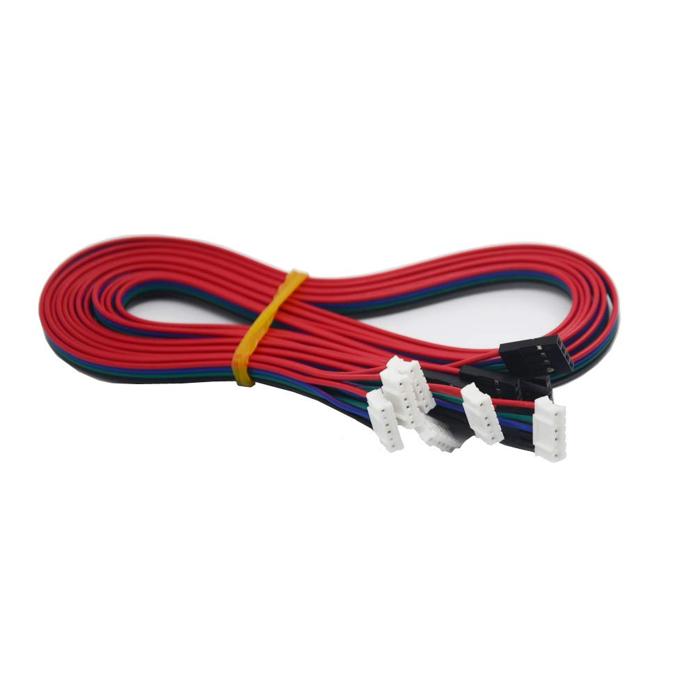
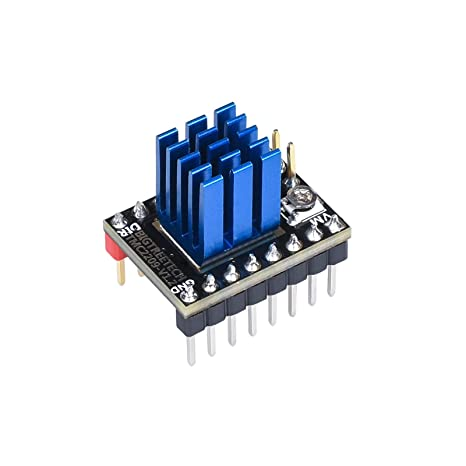

For a dual extruder setup on the Neptune 3, a number of parts are need.
- Nema 17 Stepper Motor{: style="height:150px;width:150px"}
- Cable to connect the motor with the driver{: style="height:150px;width:150px"}
- TMC2209 Driver{: style="height:150px;width:150px"}
- Extruder{: style="height:150px;width:150px"}
- A new 2 to 1 hotend or a printed Y splitter between the two extruders and the existing hotend

